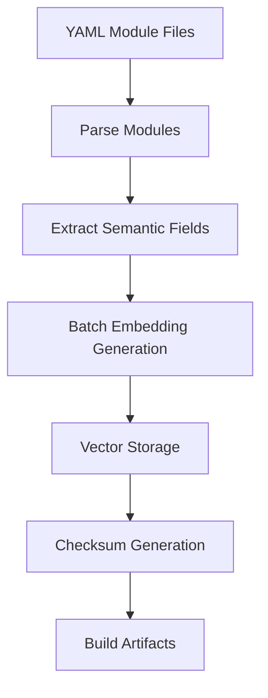
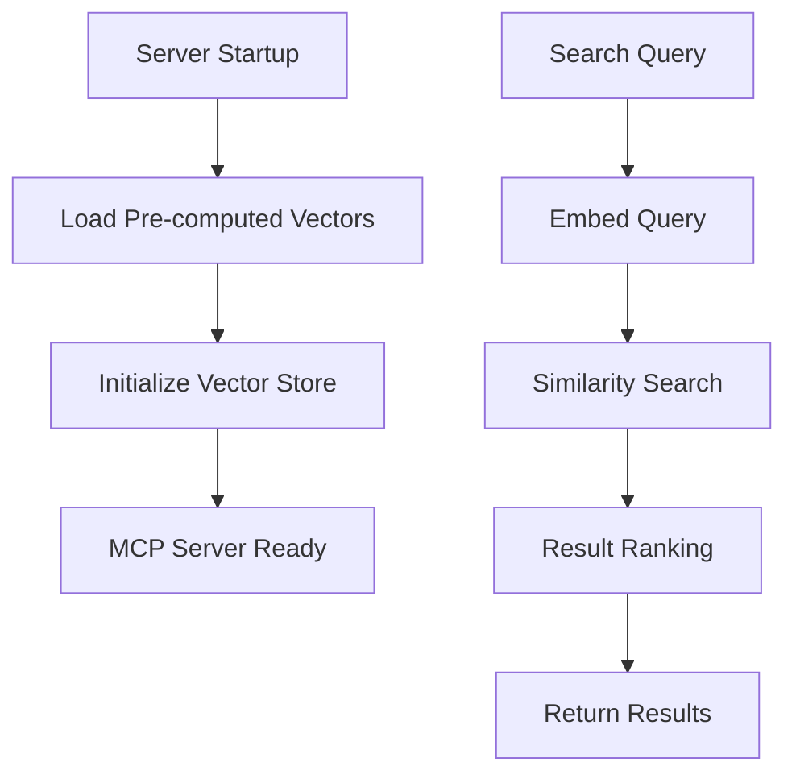
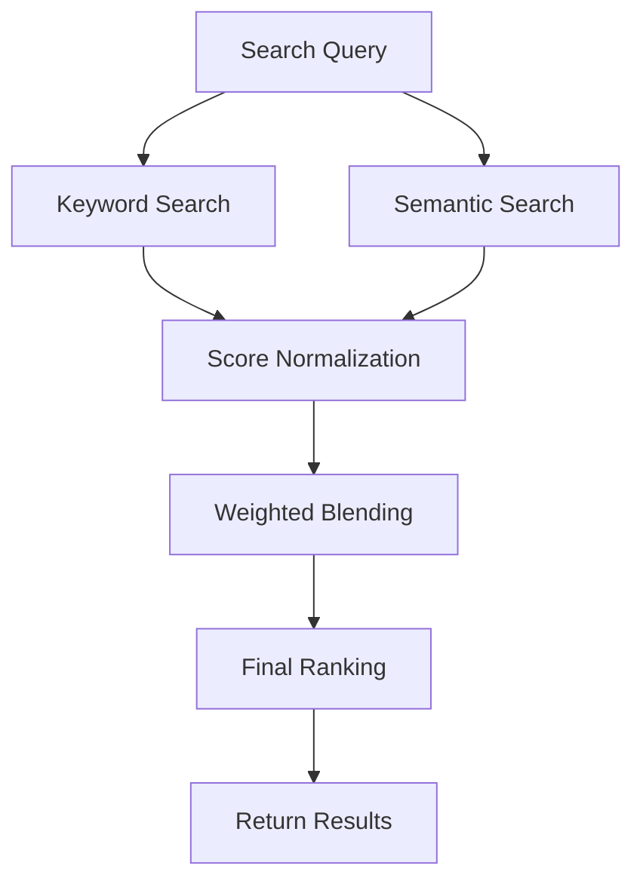

# Vector Search Architecture

This document provides a comprehensive overview of the vector search system architecture implemented in the MCP Copilot Instructions server.

- [Vector Search Architecture](#vector-search-architecture)
  - [System Overview](#system-overview)
  - [Architecture Components](#architecture-components)
    - [1. Embedding Service (`src/modules/embeddingService.ts`)](#1-embedding-service-srcmodulesembeddingservicets)
    - [2. Vector Store (`src/modules/vectorStore.ts`)](#2-vector-store-srcmodulesvectorstorets)
    - [3. Build-Time Vector Generation (`src/tools/vectorGenerator.ts`)](#3-build-time-vector-generation-srctoolsvectorgeneratorts)
    - [4. Semantic Search Service (`src/modules/semanticSearch.ts`)](#4-semantic-search-service-srcmodulessemanticsearchts)
    - [5. Hybrid Search Integration (`src/modules/semantic.ts`)](#5-hybrid-search-integration-srcmodulessemanticts)
  - [Data Flow](#data-flow)
    - [Build-Time Flow](#build-time-flow)
    - [Runtime Flow](#runtime-flow)
    - [Hybrid Search Flow](#hybrid-search-flow)
  - [Memory Management](#memory-management)
    - [Caching Strategy](#caching-strategy)
    - [Memory Lifecycle](#memory-lifecycle)
    - [Resource Optimization](#resource-optimization)
  - [Performance Characteristics](#performance-characteristics)
    - [Startup Performance](#startup-performance)
    - [Search Performance](#search-performance)
    - [Storage Efficiency](#storage-efficiency)
  - [Configuration](#configuration)
    - [Model Configuration](#model-configuration)
    - [Search Configuration](#search-configuration)
  - [Error Handling \& Resilience](#error-handling--resilience)
    - [Graceful Degradation](#graceful-degradation)
    - [Error Recovery](#error-recovery)
    - [Validation \& Integrity](#validation--integrity)
  - [Integration Points](#integration-points)
    - [MCP Server Integration](#mcp-server-integration)
    - [Build Pipeline Integration](#build-pipeline-integration)
    - [Client Integration](#client-integration)
  - [Future Extensibility](#future-extensibility)
    - [Planned Enhancements](#planned-enhancements)
    - [Extension Points](#extension-points)
  - [Troubleshooting](#troubleshooting)
    - [Common Issues](#common-issues)
    - [Debugging Tools](#debugging-tools)
    - [Performance Monitoring](#performance-monitoring)


## System Overview

The vector search system combines traditional keyword search with semantic search capabilities using locally-computed embeddings. The architecture is designed for:

- **Local-first operation**: No external API dependencies
- **Fast startup**: Pre-computed vectors eliminate cold start delays
- **Memory efficiency**: Intelligent caching and disposal mechanisms
- **Backward compatibility**: Existing keyword search functionality preserved

## Architecture Components

### 1. Embedding Service (`src/modules/embeddingService.ts`)

The core component responsible for generating text embeddings using the Transformers.js library.

**Key Features:**
- Uses `@xenova/transformers` with `all-mpnet-base-v2` model (768 dimensions)
- Local computation - no external API calls
- Intelligent caching with MD5-based deduplication
- Automatic model disposal after 5 minutes of inactivity
- Progress callbacks for initialization and batch processing
- Batch processing support for improved performance

**Architecture:**
```
EmbeddingService
├── Pipeline Management
│   ├── Model Loading (lazy initialization)
│   ├── Validation (test embeddings)
│   └── Disposal (idle timeout)
├── Caching Layer
│   ├── MD5-based text hashing
│   ├── LRU cache with timestamps
│   └── Cache statistics tracking
└── Batch Processing
    ├── Tensor validation
    ├── Dimension verification
    └── Error handling
```

### 2. Vector Store (`src/modules/vectorStore.ts`)

Manages persistent storage and retrieval of pre-computed embeddings.

**Storage Strategy:**
- Primary format: MessagePack (binary, compact)
- Fallback format: JSON (human-readable, debugging)
- Integrity validation: MD5 checksums
- Metadata separation: Module info without embeddings

**File Structure:**
```
dist/vectors/
├── vectors.msgpack     # Primary vector storage (binary)
├── vectors.json        # Fallback vector storage (text)
├── metadata.json       # Module metadata without embeddings
└── checksums.json      # Integrity validation hashes
```

**Loading Process:**
1. Check for MessagePack file existence
2. Validate checksums for integrity
3. Fall back to JSON if MessagePack unavailable
4. Build in-memory indices for fast lookup
5. Cache vectors by module ID and tier

### 3. Build-Time Vector Generation (`src/tools/vectorGenerator.ts`)

Pre-computes embeddings during the build process to eliminate runtime computation overhead.

**Generation Pipeline:**
```
Module Parsing → Semantic Field Extraction → Batch Embedding → Storage
     ↓                    ↓                      ↓             ↓
YAML files         meta.semantic only     768-dim vectors   Multiple formats
```

**Features:**
- Processes only `meta.semantic` field from instruction modules
- Batch processing with progress reporting
- Multiple output formats (JSON + MessagePack)
- Checksum generation for integrity validation
- Integration with npm build scripts

### 4. Semantic Search Service (`src/modules/semanticSearch.ts`)

Implements similarity-based search using cosine similarity on vector embeddings.

**Search Pipeline:**
```
Query Text → Embedding → Similarity Computation → Ranking → Filtering
     ↓           ↓              ↓                 ↓          ↓
User input   768-dim vector   Cosine scores    Top-K     Threshold filter
```

**Features:**
- Cosine similarity computation
- Configurable top-K result limits
- Relevance threshold filtering (high > 0.8, medium > 0.6, low > 0.4)
- Tier-based filtering support
- Similarity score normalization

### 5. Hybrid Search Integration (`src/modules/semantic.ts`)

Combines keyword and semantic search results using weighted blending.

**Hybrid Strategy:**
```
Keyword Results + Semantic Results → Score Normalization → Weighted Blend → Final Ranking
       ↓                 ↓                    ↓                  ↓              ↓
   Fuzzy scores     Cosine scores      [0,1] normalized    Alpha blending   Top results
```

**Blending Formula:**
```
final_score = alpha * normalized_keyword + (1 - alpha) * semantic_score
```

Where `alpha` controls the balance between keyword (1.0) and semantic (0.0) results.

## Data Flow

### Build-Time Flow


### Runtime Flow


### Hybrid Search Flow


## Memory Management

### Caching Strategy
- **Embedding Cache**: LRU cache with configurable size limits
- **Vector Store Cache**: In-memory indices for fast lookup
- **Model Cache**: Lazy loading with automatic disposal

### Memory Lifecycle
```
Model Loading → Active Use → Idle Period → Automatic Disposal
     ↓             ↓            ↓              ↓
   ~200MB      Cache hits   5min timeout   Memory freed
```

### Resource Optimization
- Batch processing reduces memory allocation overhead
- Automatic model disposal prevents memory leaks
- Pre-computed vectors eliminate runtime computation
- MessagePack format reduces storage and loading overhead

## Performance Characteristics

### Startup Performance
- **Cold start**: < 500ms (with pre-computed vectors)
- **Memory usage**: < 300MB peak during operation
- **Vector loading**: MessagePack provides 2-3x faster loading vs JSON

### Search Performance
- **Query latency**: < 100ms for typical queries
- **Batch processing**: 8 embeddings per batch for optimal throughput
- **Cache hit rate**: > 90% for repeated queries
- **Similarity computation**: O(n) where n is number of modules

### Storage Efficiency
- **Vector file size**: < 2MB for complete module set
- **Compression ratio**: MessagePack ~40% smaller than JSON
- **Memory footprint**: Vectors loaded on-demand, cached intelligently

## Configuration

### Model Configuration
```typescript
// Default configuration
const config = {
  modelName: 'Xenova/all-mpnet-base-v2',
  embeddingDimensions: 768,
  maxContentLength: 8192,
  cacheSize: 1000,
  disposeTimeoutMs: 300000 // 5 minutes
};
```

### Search Configuration
```typescript
// Search parameters
const searchOptions = {
  limit: 10,                    // Top-K results
  similarityThreshold: 0.4,     // Minimum similarity
  tiers: ['Foundation'],        // Tier filtering
  alpha: 0.6                    // Hybrid blend weight
};
```

## Error Handling & Resilience

### Graceful Degradation
- Vector file corruption → Fallback to runtime generation
- Model loading failure → Fallback to keyword-only search
- Embedding cache overflow → LRU eviction policy
- Network unavailable → Local-only operation (no impact)

### Error Recovery
```
Error Detection → Logging → Fallback Strategy → User Notification
      ↓             ↓           ↓                    ↓
   Try/catch   Structured   Alternative path    Error response
   blocks      logging      execution           with details
```

### Validation & Integrity
- Checksum validation for vector files
- Dimension validation for embeddings
- Input sanitization for search queries
- Type safety throughout the pipeline

## Integration Points

### MCP Server Integration
- Vector store initialization during server startup
- Lazy embedding service initialization
- Tool handlers for semantic and hybrid search
- Progress reporting for long-running operations

### Build Pipeline Integration
- npm script: `build:vectors`
- Automatic execution during main build
- CI/CD integration points
- Vector file validation

### Client Integration
- MCP tool discovery
- Structured result formats
- Error handling and fallbacks
- Progress callbacks for UI updates

## Future Extensibility

### Planned Enhancements
- Multiple embedding model support
- Vector quantization for reduced memory usage
- Incremental vector updates
- Advanced hybrid search strategies

### Extension Points
- Custom similarity metrics
- Additional storage backends
- Alternative embedding providers
- Enhanced caching strategies

## Troubleshooting

### Common Issues
1. **High memory usage**: Check model disposal settings
2. **Slow search**: Verify vector files are loaded
3. **Poor results**: Check relevance threshold settings
4. **Build failures**: Validate module semantic fields

### Debugging Tools
- Memory monitoring with `MemoryMonitor`
- Performance metrics with `PerformanceCollector`
- Structured logging throughout components
- Cache statistics and hit rates

### Performance Monitoring
```typescript
// Monitor key metrics
const metrics = {
  searchLatency: performanceCollector.getAverageLatency(),
  memoryUsage: memoryMonitor.getCurrentUsage(),
  cacheHitRate: embeddingService.getCacheStats().hitRate,
  vectorLoadTime: vectorStore.getLoadTime()
};
```

This architecture provides a robust, efficient, and maintainable foundation for semantic search capabilities while preserving the simplicity and reliability of the existing system.
